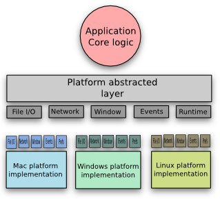

# c-gui

A *tiny* cross-platform **C** only `GUI` skeleton library.

The major dependency needed is natively available by default on the O.S.
For some *aesthetics* under **Linux** will required some additional libraries `OpenGl` besides `X11`.

This started out first on **Linux** with no prior understanding of X11 programming inferface, mainly inspired by following the pattern layout in [Minimal cross-platform graphics](https://zserge.com/posts/fenster). Digging more into *X11 universe*, the aesthetics part seemed to be a after thought.

After getting a basic functional **Linux** startup running under `WSL2`. The same **skeleton app** needed major refactoring for **Windows**, API changed to be simplier and more. I followed the [theForger's Win32 API Programming Tutorial](https://winprog.org/tutorial/) and [Windows API tutorial](https://zetcode.com/gui/winapi/).

**Apple macOS** required the most reading, and a lot of trial and error, going from *objective-c* to *c* and *back*. There is one question to ask [Can you build a foundation with a spoon?](http://stackoverflow.com/questions/10289890/how-to-write-ios-app-purely-in-c#comment13239523_10289913).

* [Minimalist Cocoa programming](https://www.cocoawithlove.com/2010/09/minimalist-cocoa-programming.html)
* [Cocoa in Pure C](https://github.com/ColleagueRiley/Cocoa-in-Pure-C)
* [The Objective-C Programming Language](https://developer.apple.com/library/archive/documentation/Cocoa/Conceptual/ObjectiveC/Chapters/ocObjectsClasses.html)
* [Cocoa Programming/Objective-C basics](https://en.wikibooks.org/wiki/Cocoa_Programming/Objective-C_basics)
* [Understanding the Objective-C Runtime](https://cocoasamurai.blogspot.com/2010/01/understanding-objective-c-runtime.html)
* [Design of a multi-platform app](https://www.cocoawithlove.com/2010/04/design-of-multi-platform-app-using.html)

The same **skeleton app** overhauled to include most **Apple macOS API** automatic logic handling, which are shortcuts to various aspects of [Cocoa examples without StoryBoard](https://github.com/gammasoft71/Examples_Cocoa) and [Cocoa macOS Examples [Objective-C]](https://github.com/NikolaGrujic91/Cocoa-macOS-Examples). Cocoa [AppKit](https://developer.apple.com/documentation/appkit/) controls without StoryBoard only by programming code (objective-c).

> NOTE: The current **Linux** and **Windows** API needs refactoring to match **Apple** behavior, now broken. The **skeleton app** *should have no platform specific code*. **Linux** will be the most challenging part without resorting to **GTK**, **Qt**. I have *no direct* plans to add, **PR** are welcome.
> This should be must *lighter* and *easier* to follow than something like [Cross-Platform C SDK - NAppGUI](https://github.com/frang75/nappgui_src).

## Download

[CMake](https://cmake.org) `FetchContent` and `find_package` is use here to setup your project `App`. Your **WILL** need to *modify* every *file* in [resources](./resources/) folder. The folder will be created in your *root directory* if it doesn't exist.

```shell

```
